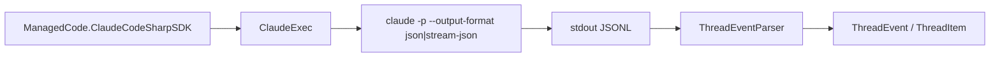

# ADR 001: Use Claude Code CLI as SDK Transport

- Status: Accepted
- Date: 2026-03-05

## Context

Claude Code is CLI-oriented and communicates through the installed `claude` binary.
To keep behavior parity and reduce protocol drift, this .NET SDK needs a transport strategy aligned with real CLI behavior.

For runtime behavior, the practical source of truth is the observed print-mode contract:
- `claude -p --output-format json`
- `claude -p --output-format stream-json --verbose`

## Decision

Use the local Claude Code CLI process as the only runtime transport layer for `ManagedCode.ClaudeCodeSharpSDK`.

- `ClaudeExec` builds argument order and environment variables.
- `DefaultClaudeProcessRunner` starts the process and streams stdout lines asynchronously.
- `ThreadEventParser` maps the observed `stream-json` protocol to strongly typed events and items.

## Diagram

## Consequences

### Positive

- High parity with upstream Claude Code CLI behavior.
- No separate protocol server to maintain.
- Easier compatibility when Claude Code CLI adds flags or events.

### Negative

- Requires `claude` binary availability in the environment.
- Runtime errors may come from external process failures.

### Neutral

- SDK remains process-boundary integration; unit tests may substitute process runners where appropriate, but CLI smoke coverage still uses the real `claude` binary.

## Alternatives considered

- Direct HTTP protocol implementation: rejected due to drift risk and higher maintenance.
- TCP/daemon transport abstraction now: deferred; may be revisited if Claude Code introduces a stable server mode.
