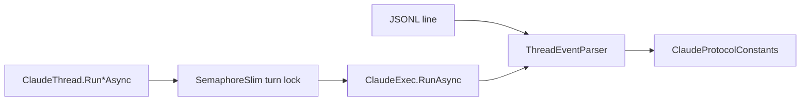

# ADR 002: Explicit Protocol Constants and Serialized Per-ClaudeThread Turns

- Status: Accepted
- Date: 2026-03-05

## Context

Claude Code CLI emits dynamic non-interactive events in print mode, observed primarily through:
- `claude -p --output-format json`
- `claude -p --output-format stream-json --verbose`

This observed CLI protocol is the source of truth for the SDK parser.

Claude Code CLI emits dynamic JSONL events (`system`, `assistant`, `user`, `result`, and similar).
Without strict parsing rules and synchronized turn execution, SDK behavior can diverge under concurrency and protocol evolution.
Project rules explicitly forbid inline string literals for protocol token matching.

## Decision

1. Centralize protocol tokens in `ClaudeProtocolConstants`.
2. Parse events and items only through constant-based switches.
3. Serialize execution per `ClaudeThread` instance with `SemaphoreSlim`.

## Diagram

## Consequences

### Positive

- No magic literals in parser logic.
- Safer maintenance when protocol tokens change.
- Eliminates race conditions for the same thread instance.

### Negative

- Additional constants maintenance when upstream adds new token names.

### Neutral

- Multi-thread concurrency is still allowed across different `ClaudeThread` instances.

## Alternatives considered

- Keep inline string literals: rejected by project rule and maintainability concerns.
- Lock-free per-thread execution: rejected due to shared thread state (`thread_id`, event stream aggregation).
