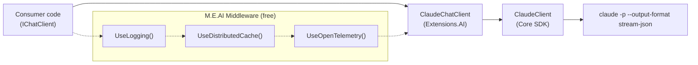

# ADR 003: Microsoft.Extensions.AI Integration

- Status: Accepted
- Date: 2026-03-05

## Context

`ManagedCode.ClaudeCodeSharpSDK` wraps the Claude Code CLI with a bespoke API surface (`ClaudeClient`/`ClaudeThread`/`RunResult`). The .NET ecosystem has standardized on `Microsoft.Extensions.AI` abstractions (`IChatClient`) for provider-agnostic AI integration with composable middleware pipelines.

## Decision

Implement `IChatClient` from `Microsoft.Extensions.AI.Abstractions` in a **separate NuGet package** (`ManagedCode.ClaudeCodeSharpSDK.Extensions.AI`) that adapts the existing SDK types without modifying the core SDK.

### Key design choices

1. **Separate package** — Core SDK remains M.E.AI-free. The adapter is opt-in, following the pattern of other provider-specific `Extensions.AI` integrations.

2. **Text-first adapter** — The current adapter maps Claude chat usage to assistant text, usage, conversation ID, and streaming updates. It does not attempt to expose every Claude internal item type through custom `AIContent` contracts.

3. **Claude-specific options via `AdditionalProperties`** — Standard `ChatOptions` properties (`ModelId`, `ConversationId`) map directly. Claude-unique features use `claude:*` prefixed keys in `ChatOptions.AdditionalProperties` (for example `claude:permission_mode`, `claude:allowed_tools`, `claude:max_budget_usd`).

4. **Thread-per-call with `ConversationId` resume** — Each `GetResponseAsync` call creates or resumes a `ClaudeThread`. Thread ID flows via `ChatResponse.ConversationId` for multi-turn continuity.

5. **No `AITool` support** — Claude Code CLI manages tools internally. Consumer-registered `ChatOptions.Tools` are ignored.

## Diagram

## Consequences

### Positive

- SDK participates in the .NET AI ecosystem: DI registration, middleware pipelines, provider swapping.
- Consumers get logging, caching, and telemetry for free via M.E.AI middleware.
- Adapter stays simple and aligned with the currently validated CLI print-mode contract.

### Negative

- Impedance mismatch: Claude is an agentic coding tool, not a simple chat API. Multi-turn via message history does not map cleanly and instead uses thread resume.
- Image `DataContent` is currently unsupported because the validated print-mode contract in this SDK is text-only.
- Streaming is item-level, not token-level.

### Neutral

- Additional NuGet package to maintain.
- `ChatOptions.Tools` is a documented no-op.

## Alternatives considered

- Implement `IChatClient` directly in the core SDK: rejected to avoid a mandatory M.E.AI dependency.
- Model the adapter as text-only over the validated print-mode contract: accepted for now because it matches the current supported SDK surface and is easy to evolve later.
