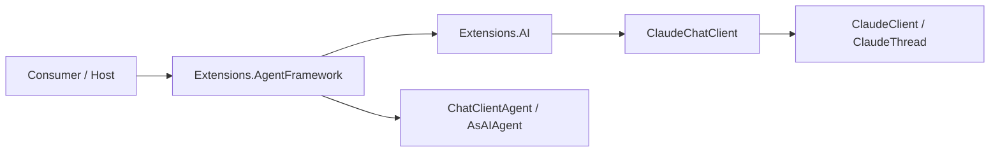

# ADR 004: Microsoft Agent Framework Integration

- Status: Accepted
- Date: 2026-03-16

## Context

ClaudeCodeSharpSDK already exposes `ManagedCode.ClaudeCodeSharpSDK.Extensions.AI`, which adapts the Claude Code CLI runtime to `Microsoft.Extensions.AI` through `ClaudeChatClient : IChatClient`. Microsoft Agent Framework provides a general `IChatClient.AsAIAgent(...)` path plus provider-specific bridge packages such as `Microsoft.Agents.AI.GitHub.Copilot` for backends that do not implement `IChatClient`.

Goals:

- enable Claude-backed `AIAgent` usage with documented, supported package boundaries
- keep the existing core SDK and M.E.AI adapter modular
- provide DI convenience for `AIAgent` registration without inventing a parallel agent runtime

Non-goals:

- implementing a custom `AIAgent` runtime like the GitHub Copilot provider
- adding MAF hosting/workflow packages or durable orchestration support
- changing core `ClaudeClient` / `ClaudeThread` behaviour

## Decision

Implement Microsoft Agent Framework support as a separate opt-in package, `ManagedCode.ClaudeCodeSharpSDK.Extensions.AgentFramework`, that composes the existing `ClaudeChatClient` with `Microsoft.Agents.AI` `ChatClientAgent`/`AsAIAgent(...)` and provides DI registration helpers.

Key points:

1. Keep MAF dependency out of core SDK and out of `ManagedCode.ClaudeCodeSharpSDK.Extensions.AI`.
2. Reuse the existing `IChatClient` adapter instead of creating a bespoke Claude-specific `AIAgent`.
3. Expose DI helpers for both non-keyed and keyed `AIAgent` registration to make the integration first-class for host applications.

## Diagram

## Alternatives considered

### Add `Microsoft.Agents.AI` directly to `ManagedCode.ClaudeCodeSharpSDK.Extensions.AI`

- Pros:
  - fewer packages for consumers
  - no extra adapter project
- Cons:
  - forces MAF dependency onto every `IChatClient` consumer
  - mixes two different integration boundaries into one package
- Rejected because the repository already treats ecosystem adapters as opt-in boundaries.

### Implement a custom `ClaudeCodeAgent` class

- Pros:
  - would look similar to `GitHubCopilotAgent`
  - full control over session behaviour
- Cons:
  - duplicates functionality already provided by `ChatClientAgent`
  - increases maintenance and behavioural drift risk
- Rejected because Claude already exposes the canonical `IChatClient` abstraction required by MAF.

### Document manual `AsAIAgent(...)` usage only

- Pros:
  - smallest code change
  - no new package
- Cons:
  - no first-class DI helpers
  - no explicit repository boundary for MAF support
- Rejected because the requested integration should exist as a supported package in this repository, not just as an undocumented possibility in consumer code.

## Consequences

### Positive

- Preserves a clean dependency ladder: core SDK -> M.E.AI adapter -> MAF adapter.
- Aligns with the official Microsoft pattern of separate bridge packages for agent-framework integrations.
- Gives consumers a documented one-package path for MAF registration while keeping direct `AsAIAgent(...)` usage intact.

### Negative / risks

- Adds one more optional NuGet package to maintain.
- Introduces a preview/RC ecosystem dependency surface from Microsoft Agent Framework.

Mitigation:

- keep the integration thin and DI-focused
- verify published dependency version from official NuGet before pinning
- cover the new layer with DI unit tests instead of new auth-dependent integration tests

## Verification

- `dotnet build ManagedCode.ClaudeCodeSharpSDK.slnx -c Release -warnaserror`
- focused agent-framework tests in `ClaudeServiceCollectionExtensionsTests`
- `dotnet test --solution ManagedCode.ClaudeCodeSharpSDK.slnx -c Release`
- `dotnet format ManagedCode.ClaudeCodeSharpSDK.slnx`

## References

- Feature spec: `docs/Features/agent-framework-integration.md`
- M.E.AI base layer: `docs/ADR/003-microsoft-extensions-ai-integration.md`
- Official docs: `https://learn.microsoft.com/en-us/agent-framework/agents/providers/github-copilot?pivots=programming-language-csharp`
- Reference implementation: `https://github.com/microsoft/agent-framework`
