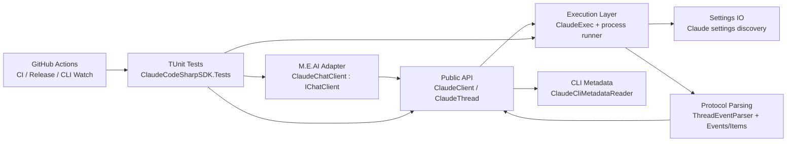
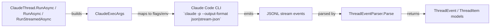
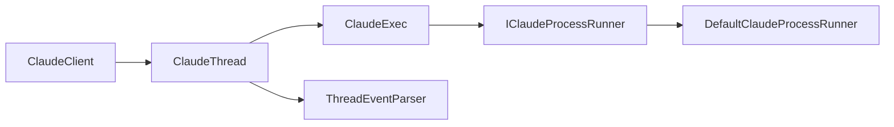

# Architecture Overview

Goal: understand quickly what exists in `ManagedCode.ClaudeCodeSharpSDK`, where it lives, and how modules interact.

Single source of truth: this file is navigational and coarse. Detailed behavior lives in `docs/Features/*`. Architectural rationale lives in `docs/ADR/*`.

## Summary

- **System:** .NET SDK wrapper over the Claude Code CLI print-mode protocol and non-interactive execution surface.
- **Where is the code:** core SDK in `ClaudeCodeSharpSDK`; optional M.E.AI adapter in `ClaudeCodeSharpSDK.Extensions.AI`; automated coverage in `ClaudeCodeSharpSDK.Tests`.
- **Entry points:** `ClaudeClient`, `ClaudeChatClient` (`IChatClient` adapter).
- **Dependencies:** local `claude` CLI process, `System.Text.Json`, `Microsoft.Extensions.AI` (adapter package), GitHub Actions.

## Scoping (read first)

- **In scope:** SDK API surface, CLI argument mapping, event parsing, thread lifecycle, docs, tests, CI workflows.
- **Out of scope:** Claude Code CLI internals (`submodules/anthropic-claude-code`), non-.NET SDKs, infrastructure outside this repository.
- Start by mapping the request to a module below, then follow linked feature/ADR docs.

## 1) Diagrams

### 1.1 System / module map

### 1.2 Interfaces / contracts map

### 1.3 Key classes / types map

## 2) Navigation index

### 2.1 Modules

- `Public API` — code: [ClaudeClient.cs](../../ClaudeCodeSharpSDK/Client/ClaudeClient.cs), [ClaudeThread.cs](../../ClaudeCodeSharpSDK/Client/ClaudeThread.cs); docs: [thread-run-flow.md](../Features/thread-run-flow.md)
- `Execution Layer` — code: [ClaudeExec.cs](../../ClaudeCodeSharpSDK/Execution/ClaudeExec.cs), [ClaudeExecArgs.cs](../../ClaudeCodeSharpSDK/Execution/ClaudeExecArgs.cs)
- `Protocol Parsing` — code: [ThreadEventParser.cs](../../ClaudeCodeSharpSDK/Internal/ThreadEventParser.cs), [ClaudeProtocolConstants.cs](../../ClaudeCodeSharpSDK/Internal/ClaudeProtocolConstants.cs), [Events.cs](../../ClaudeCodeSharpSDK/Models/Events.cs), [Items.cs](../../ClaudeCodeSharpSDK/Models/Items.cs)
- `Config IO` — code: [ClaudeOptions.cs](../../ClaudeCodeSharpSDK/Configuration/ClaudeOptions.cs), [ClaudeCliMetadataReader.cs](../../ClaudeCodeSharpSDK/Internal/ClaudeCliMetadataReader.cs)
- `CLI Metadata` — code: [ClaudeCliMetadataReader.cs](../../ClaudeCodeSharpSDK/Internal/ClaudeCliMetadataReader.cs), [ClaudeCliMetadata.cs](../../ClaudeCodeSharpSDK/Models/ClaudeCliMetadata.cs); docs: [cli-metadata.md](../Features/cli-metadata.md)
- `M.E.AI Adapter` — code: [ClaudeChatClient.cs](../../ClaudeCodeSharpSDK.Extensions.AI/ClaudeChatClient.cs), [ClaudeServiceCollectionExtensions.cs](../../ClaudeCodeSharpSDK.Extensions.AI/Extensions/ClaudeServiceCollectionExtensions.cs); docs: [meai-integration.md](../Features/meai-integration.md); ADR: [003-microsoft-extensions-ai-integration.md](../ADR/003-microsoft-extensions-ai-integration.md)
- `Testing` — code: [ClaudeCodeSharpSDK.Tests](../../ClaudeCodeSharpSDK.Tests); docs: [strategy.md](../Testing/strategy.md)
- `Automation` — workflows: [.github/workflows](../../.github/workflows) (including `claude-cli-smoke.yml` and `claude-cli-watch.yml`); docs: [release-and-sync-automation.md](../Features/release-and-sync-automation.md)

### 2.2 Interfaces / contracts

- `Claude Code CLI invocation contract` — source: observed `claude -p --output-format json|stream-json` behavior, implemented in [ClaudeExec.cs](../../ClaudeCodeSharpSDK/Execution/ClaudeExec.cs); producer: `ClaudeExec`; consumer: local `claude` binary; rationale: [001-claude-cli-wrapper.md](../ADR/001-claude-cli-wrapper.md)
- `JSONL thread event contract` — source: observed `claude -p --output-format stream-json --verbose` behavior, parsed in [ThreadEventParser.cs](../../ClaudeCodeSharpSDK/Internal/ThreadEventParser.cs); producer: Claude Code CLI; consumer: `ClaudeThread`; rationale: [002-protocol-parsing-and-thread-serialization.md](../ADR/002-protocol-parsing-and-thread-serialization.md)

### 2.3 Key classes / types

- `ClaudeClient` — [ClaudeClient.cs](../../ClaudeCodeSharpSDK/Client/ClaudeClient.cs)
- `ClaudeThread` — [ClaudeThread.cs](../../ClaudeCodeSharpSDK/Client/ClaudeThread.cs)
- `ClaudeExec` — [ClaudeExec.cs](../../ClaudeCodeSharpSDK/Execution/ClaudeExec.cs)
- `ThreadEventParser` — [ThreadEventParser.cs](../../ClaudeCodeSharpSDK/Internal/ThreadEventParser.cs)
- `ClaudeProtocolConstants` — [ClaudeProtocolConstants.cs](../../ClaudeCodeSharpSDK/Internal/ClaudeProtocolConstants.cs)
- `ClaudeCliMetadataReader` — [ClaudeCliMetadataReader.cs](../../ClaudeCodeSharpSDK/Internal/ClaudeCliMetadataReader.cs)

## 3) Dependency rules

- Allowed dependencies:
  - `ClaudeCodeSharpSDK.Tests/*` -> `ClaudeCodeSharpSDK/*`
  - `ClaudeCodeSharpSDK.Tests/*` -> `ClaudeCodeSharpSDK.Extensions.AI/*`
  - `ClaudeCodeSharpSDK.Extensions.AI/*` -> `ClaudeCodeSharpSDK/*`
  - Public API (`ClaudeClient`, `ClaudeThread`) -> internal execution/parsing helpers.
- Forbidden dependencies:
  - No dependency from `ClaudeCodeSharpSDK/*` to `ClaudeCodeSharpSDK.Tests/*`.
  - No dependency from `ClaudeCodeSharpSDK/*` to `ClaudeCodeSharpSDK.Extensions.AI/*` unless via explicit adapter boundaries.
  - No runtime dependency on `submodules/anthropic-claude-code`; submodule is reference-only.
- Integration style:
  - sync configuration + async process stream consumption (`IAsyncEnumerable<string>`)
  - JSONL event protocol parsing and mapping to strongly-typed C# models.

## 4) Key decisions (ADRs)

- [001-claude-cli-wrapper.md](../ADR/001-claude-cli-wrapper.md) — wrap Claude Code CLI process as SDK transport.
- [002-protocol-parsing-and-thread-serialization.md](../ADR/002-protocol-parsing-and-thread-serialization.md) — explicit protocol constants and serialized per-thread turn execution.
- [003-microsoft-extensions-ai-integration.md](../ADR/003-microsoft-extensions-ai-integration.md) — `IChatClient` adapter in a separate package.

## 5) Where to go next

- Features: [docs/Features/](../Features/)
- Decisions: [docs/ADR/](../ADR/)
- Testing: [docs/Testing/strategy.md](../Testing/strategy.md)
- Development setup: [docs/Development/setup.md](../Development/setup.md)
