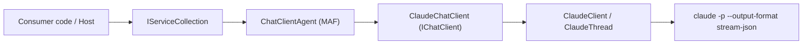

# Feature: Microsoft Agent Framework Integration

Links:
Architecture: [docs/Architecture/Overview.md](../Architecture/Overview.md)
Modules: [ClaudeCodeSharpSDK.Extensions.AgentFramework](../../ClaudeCodeSharpSDK.Extensions.AgentFramework), [ClaudeCodeSharpSDK.Extensions.AI](../../ClaudeCodeSharpSDK.Extensions.AI)
ADRs: [004-microsoft-agent-framework-integration.md](../ADR/004-microsoft-agent-framework-integration.md), [003-microsoft-extensions-ai-integration.md](../ADR/003-microsoft-extensions-ai-integration.md)

---

## Purpose

Enable ClaudeCodeSharpSDK consumers to use Microsoft Agent Framework (`AIAgent`) on top of the existing `ClaudeChatClient` adapter, with a first-class opt-in package and DI registration helpers that match the repository's adapter-per-boundary approach.

---

## Scope

### In scope

- new optional package `ManagedCode.ClaudeCodeSharpSDK.Extensions.AgentFramework`
- DI helpers `AddClaudeCodeAgent()` and `AddKeyedClaudeCodeAgent()`
- composition of `ClaudeChatClient` with `Microsoft.Agents.AI` `ChatClientAgent`
- README and docs updates showing direct `AsAIAgent(...)` and DI usage
- prerelease package publishing while upstream `Microsoft.Agents.AI` remains prerelease

### Out of scope

- new custom `AIAgent` runtime parallel to `ChatClientAgent`
- Microsoft Agent Framework hosting/workflows helpers (`Microsoft.Agents.AI.Hosting`, durable agents, DevUI)
- changes to core SDK execution, thread state, parsing, or CLI contracts

---

## Business Rules

1. Microsoft Agent Framework integration MUST remain opt-in via a separate package and MUST NOT add a `Microsoft.Agents.AI` dependency to `ManagedCode.ClaudeCodeSharpSDK` core or `ManagedCode.ClaudeCodeSharpSDK.Extensions.AI`.
2. The integration MUST compose the existing `ClaudeChatClient` (`IChatClient`) with the canonical MAF `AsAIAgent(...)` / `ChatClientAgent` path instead of introducing a bespoke agent runtime.
3. `AddClaudeCodeAgent()` MUST register both `IChatClient` and `AIAgent` so consumers can resolve either abstraction from the same container.
4. `AddKeyedClaudeCodeAgent()` MUST register keyed `IChatClient` and keyed `AIAgent` using the same service key.
5. Agent configuration supplied through `ChatClientAgentOptions` MUST flow into the created agent without mutating Claude-specific chat client defaults.
6. Claude provider metadata exposed through `ChatClientMetadata` MUST remain available from the agent-resolved chat client.
7. `ManagedCode.ClaudeCodeSharpSDK.Extensions.AgentFramework` MUST be published as a prerelease package while its upstream `Microsoft.Agents.AI` dependency is prerelease.

---

## User Flows

### Primary flows

1. Direct MAF usage over `ClaudeChatClient`
   - Actor: consumer code using `AIAgent`
   - Trigger: `new ClaudeChatClient().AsAIAgent(...)`
   - Steps: construct `ClaudeChatClient` -> call MAF `AsAIAgent(...)` -> run prompt via `RunAsync`/`RunStreamingAsync`
   - Result: standard `AIAgent` backed by Claude CLI through the existing `IChatClient` adapter

2. DI registration
   - Actor: ASP.NET / worker / console host using `IServiceCollection`
   - Trigger: `services.AddClaudeCodeAgent(...)`
   - Steps: register `ClaudeChatClient` -> create `ChatClientAgent` with configured options -> resolve `AIAgent`
   - Result: one-line registration for MAF consumers

3. Keyed DI registration
   - Actor: multi-agent / multi-provider host
   - Trigger: `services.AddKeyedClaudeCodeAgent("claude-main", ...)`
   - Steps: register keyed `IChatClient` -> create keyed `AIAgent` -> resolve by key
   - Result: keyed Claude-backed agents coexist with other providers in the same DI container

### Edge cases

- null `IServiceCollection` or null keyed service key -> throw argument exceptions from the registration layer
- missing `ChatClientAgentOptions` configuration -> registration still succeeds with default `ChatClientAgent`
- MAF middleware decoration wraps the underlying chat client -> Claude metadata must still be discoverable via the resolved agent chat client

---

## System Behaviour

- Entry points: `ClaudeServiceCollectionExtensions.AddClaudeCodeAgent`, `ClaudeServiceCollectionExtensions.AddKeyedClaudeCodeAgent`
- Reads from: `ClaudeChatClientOptions`, `ChatClientAgentOptions`, DI `ILoggerFactory`
- Writes to: DI service collection only
- Side effects / emitted events: creates singleton `ClaudeChatClient` and singleton/keyed `ChatClientAgent`
- Idempotency: follows standard DI additive registration semantics; repeated registration adds additional descriptors
- Error handling: null guard exceptions on registration inputs; runtime agent execution errors are delegated to existing `ClaudeChatClient` / MAF behaviour
- Security / permissions: no new permissions beyond existing `claude` CLI prerequisites; MAF function invocation remains opt-in through consumer-supplied tools/options
- Observability: MAF logger factory is passed into `ChatClientAgent`, preserving standard MAF logging hooks

---

## Diagram

---

## Verification

### Test commands

- build: `dotnet build ManagedCode.ClaudeCodeSharpSDK.slnx -c Release -warnaserror`
- test: `dotnet test --solution ManagedCode.ClaudeCodeSharpSDK.slnx -c Release`

### Test mapping

- unit tests: [ClaudeServiceCollectionExtensionsTests.cs](../../ClaudeCodeSharpSDK.Tests/AgentFramework/ClaudeServiceCollectionExtensionsTests.cs)

---

## Definition of Done

- `ManagedCode.ClaudeCodeSharpSDK.Extensions.AgentFramework` exists as a separate opt-in package
- the package is published with a prerelease suffix while `Microsoft.Agents.AI` remains prerelease
- direct `ClaudeChatClient` + `AsAIAgent(...)` usage is documented in `README.md`
- DI helpers register non-keyed and keyed `AIAgent` instances over Claude chat clients
- automated tests cover happy path and keyed-edge path registration behaviour
- architecture overview, feature doc, ADR, and development setup docs reflect the new module boundary
