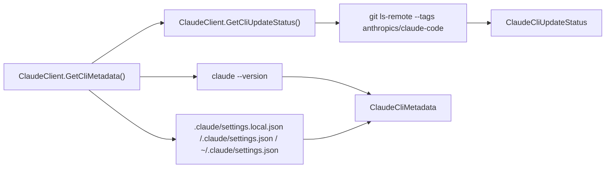

# Feature: Claude Code CLI Metadata

Links:
Architecture: [docs/Architecture/Overview.md](../Architecture/Overview.md)
Modules: [ClaudeClient.cs](../../ClaudeCodeSharpSDK/Client/ClaudeClient.cs), [ClaudeCliMetadataReader.cs](../../ClaudeCodeSharpSDK/Internal/ClaudeCliMetadataReader.cs), [ClaudeCliMetadata.cs](../../ClaudeCodeSharpSDK/Models/ClaudeCliMetadata.cs)
Source of truth: local `claude` CLI behavior + upstream `anthropics/claude-code` tags and settings layout

---

## Purpose

Expose runtime Claude Code CLI metadata to SDK consumers:

- installed `claude` version
- default model configured in local Claude config
- SDK-known Claude model aliases/constants
- update availability status vs latest upstream tagged Claude Code version

The repository's upstream sync workflow separately tracks source changes in `anthropics/claude-code`.

---

## Scope

### In scope

- `ClaudeClient.GetCliMetadata()` public API.
- `ClaudeClient.GetCliUpdateStatus()` public API.
- Reading version from `claude --version`.
- Reading default model from Claude settings discovery (`.claude/settings.local.json`, `.claude/settings.json`, `~/.claude/settings.json`) with SDK fallback alias `sonnet`.
- Reading latest upstream tagged version from `https://github.com/anthropics/claude-code.git`.
- Returning `claude update` in update status when a newer upstream tag exists.

### Out of scope

- Remote model discovery over Anthropic APIs.
- Mutating user Claude config files.
- Replacing Claude Code CLI model selection logic.

---

## Business Rules

- Metadata read is read-only and does not mutate local Claude state.
- SDK option and metadata decisions are based on real Claude Code CLI behavior, not any separate SDK surface.
- Update check failures (for example missing `git` or network access) must return actionable status messages and never silently fail.
- Version/update probes must drain subprocess stdout and stderr concurrently so CLI metadata reads cannot deadlock on buffered process output.
- The upstream sync watcher must raise a repository issue when `anthropics/claude-code` moves ahead of the pinned submodule SHA.

---

## Diagram

---

## Verification

- Unit parsing/update-check coverage: [ClaudeCliMetadataReaderTests.cs](../../ClaudeCodeSharpSDK.Tests/Unit/ClaudeCliMetadataReaderTests.cs)
- CLI arg behavior: [ClaudeExecTests.cs](../../ClaudeCodeSharpSDK.Tests/Unit/ClaudeExecTests.cs)
