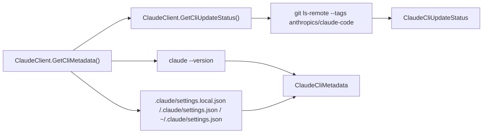

# Feature: Claude Code CLI Metadata

Links:
Architecture: [docs/Architecture/Overview.md](../Architecture/Overview.md)
Modules: [ClaudeClient.cs](../../ClaudeCodeSharpSDK/Client/ClaudeClient.cs), [ClaudeCliMetadataReader.cs](../../ClaudeCodeSharpSDK/Internal/ClaudeCliMetadataReader.cs), [ClaudeCliMetadata.cs](../../ClaudeCodeSharpSDK/Models/ClaudeCliMetadata.cs)
Source of truth: local `claude` CLI behavior + upstream `anthropics/claude-code` tags and settings layout

---

## Purpose

The SDK package version mirrors the targeted Claude Code CLI version in its first three numeric components and uses the fourth component for an SDK hotfix. `ClaudeCliCompatibility.TargetVersion` exposes the exact compatible CLI target without starting a process. `GetCliUpdateStatus()` separately reports the latest version discovered from upstream.

Expose runtime Claude Code CLI metadata to SDK consumers:

- installed `claude` version
- default model configured in local Claude config
- SDK-known Claude model aliases/constants
- update availability status vs latest upstream tagged Claude Code version

The repository's upstream sync workflow separately tracks source changes in `anthropics/claude-code`.

---

## Scope

### In scope

- `ClaudeClient.GetCliMetadata()` public API.
- `ClaudeClient.GetCliUpdateStatus()` public API.
- Reading version from `claude --version`.
- Reading default model from Claude settings discovery (`.claude/settings.local.json`, `.claude/settings.json`, `~/.claude/settings.json`) with SDK fallback alias `sonnet`.
- Reading latest upstream tagged version from `https://github.com/anthropics/claude-code.git`.
- Returning `claude update` in update status when a newer upstream tag exists.
- Installing/updating the SDK-pinned CLI in the SDK-owned per-user installation root.

### Out of scope

- Remote model discovery over Anthropic APIs.
- Mutating user Claude config files.
- Replacing Claude Code CLI model selection logic.
- Mutating a separately detected global or project-local Claude installation.

---

## Business Rules

- Metadata read is read-only and does not mutate local Claude state.
- SDK option and metadata decisions are based on real Claude Code CLI behavior, not any separate SDK surface.
- Update check failures (for example missing `git` or network access) must return actionable status messages and never silently fail.
- Version/update probes must drain subprocess stdout and stderr concurrently so CLI metadata reads cannot deadlock on buffered process output.
- Metadata subprocesses use the same configured environment policy as SDK execution, and their runtime/output bounds are configured by `ClaudeOptions.CliMetadataProbeTimeout` and `ClaudeOptions.CliMetadataMaximumOutputCharacters`.
- A timeout kills the process tree and confirms root-process exit. Output is drained concurrently with bounded capture; exceeding either stream's cap fails the probe instead of parsing partial output.
- The upstream sync watcher must raise a repository issue when `anthropics/claude-code` moves ahead of the pinned submodule SHA.

## SDK-owned installation

`ClaudeClient.InstallOrUpdateCliAsync(CliInstallationOptions, CancellationToken)` installs exactly `ClaudeCliCompatibility.TargetVersion` through an explicitly configured npm or Bun package manager. The public API always writes under `LocalApplicationData/ManagedCode/ManagedCode.ClaudeCodeSharpSDK/cli`; callers cannot choose another installation root or provide command arguments. npm is launched as the configured absolute Node executable plus the validated `npm-cli.js` entrypoint, and Bun is launched directly with SDK-owned literal arguments.

The options require the package-manager executable, npm entrypoint when applicable, a minimal allowlisted environment, install and termination timeouts, a per-root lock wait, and metadata/output limits. Provider credentials and arbitrary environment variables are rejected. Progress reports only lifecycle stage and stdout/stderr character counts; it never returns package-manager output text. `Installed` is emitted only after the bounded package manifest matches the exact target and the normal CLI resolver returns a verified `CliLaunchCommand`. Cancellation, nonzero exit, output overflow, timeout, version mismatch, and unconfirmed cleanup fail the stream.

Pass `CliInstallationResult.LaunchCommand` to `ClaudeOptions.LaunchCommand` when constructing the MEAI client. This preserves safe literal prefix arguments such as `node.exe` plus the installed JavaScript entrypoint on Windows.

The root lock serializes install/update operations across processes. An ownership marker prevents reuse of a nonempty directory that was not created by this SDK. The test assembly uses the internal local-application-data-root seam to run real npm child processes inside `tests/.sandbox`; the public API has no root override.

---

## Diagram

```mermaid
flowchart LR
  Client["ClaudeClient.GetCliMetadata()"] --> Version["claude --version"]
  Client --> Update["ClaudeClient.GetCliUpdateStatus()"]
  Client --> Config[".claude/settings.local.json /.claude/settings.json / ~/.claude/settings.json"]
  Update --> Git["git ls-remote --tags anthropics/claude-code"]
  Version --> Metadata["ClaudeCliMetadata"]
  Git --> UpdateStatus["ClaudeCliUpdateStatus"]
  Config --> Metadata
```

---

## Verification

- Unit parsing/update-check coverage: [ClaudeCliMetadataReaderTests.cs](../../ClaudeCodeSharpSDK.Tests/Unit/ClaudeCliMetadataReaderTests.cs)
- CLI arg behavior: [ClaudeExecTests.cs](../../ClaudeCodeSharpSDK.Tests/Unit/ClaudeExecTests.cs)
- Isolated install/update process behavior: [CliInstallationTests.cs](../../ClaudeCodeSharpSDK.Tests/Unit/CliInstallationTests.cs)
