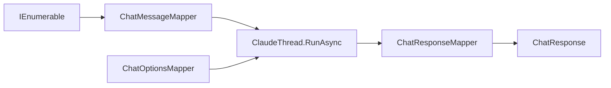

# Feature: Microsoft.Extensions.AI Integration

Links:
Architecture: [docs/Architecture/Overview.md](../Architecture/Overview.md)
Modules: [ClaudeChatClient.cs](../../ClaudeCodeSharpSDK.Extensions.AI/ClaudeChatClient.cs), [ClaudeServiceCollectionExtensions.cs](../../ClaudeCodeSharpSDK.Extensions.AI/Extensions/ClaudeServiceCollectionExtensions.cs)
ADRs: [003-microsoft-extensions-ai-integration.md](../ADR/003-microsoft-extensions-ai-integration.md)

---

## Purpose

Enable `ManagedCode.ClaudeCodeSharpSDK` to participate as a first-class provider in the `Microsoft.Extensions.AI` ecosystem by implementing `IChatClient`, unlocking DI registration, middleware pipelines, and provider-agnostic consumer code.

---

## Scope

### In scope

- `IChatClient` implementation (`ClaudeChatClient`) adapting `ClaudeClient`/`ClaudeThread`
- Input mapping: `ChatMessage[]` -> single Claude prompt string
- Output mapping: `RunResult` -> `ChatResponse` with assistant text and `UsageDetails`
- Streaming: `ThreadEvent` -> `ChatResponseUpdate` mapping
- DI registration via `AddClaudeChatClient()` / `AddKeyedClaudeChatClient()`
- Claude-specific options via `ChatOptions.AdditionalProperties` with `claude:*` prefix

### Out of scope

- `IEmbeddingGenerator` (Claude Code CLI is not an embedding service)
- `IImageGenerator` (Claude Code CLI is not an image generator)
- Consumer-side `AITool` registration (Claude manages tools internally)
- Image/file prompt attachments in the current print-mode adapter

---

## Business Rules

- `ChatOptions.ModelId` maps to `ThreadOptions.Model`.
- `ChatOptions.ConversationId` triggers thread resume via `ResumeThread(id)`.
- Multiple `ChatMessage` entries are concatenated into a single prompt while preserving original message chronology (Claude Code CLI is single-prompt-per-turn).
- `DataContent` is rejected with `NotSupportedException` because current Claude print-mode support is text-only in this SDK.
- `ChatOptions.Tools` is ignored.
- `GetService<ChatClientMetadata>()` currently returns provider name `"ClaudeCodeCLI"`.
- Streaming events map assistant-message and usage events, not token-level deltas.
- Turn failures (`TurnFailedEvent`) propagate as `InvalidOperationException`.
- `ChatOptions.AdditionalProperties` currently supports `claude:working_directory`, `claude:permission_mode`, `claude:allowed_tools`, `claude:disallowed_tools`, `claude:system_prompt`, `claude:append_system_prompt`, and `claude:max_budget_usd`.

---

## User Flows

### Primary flows

1. Basic chat completion
   - Actor: consumer code using `IChatClient`
   - Trigger: `client.GetResponseAsync([new ChatMessage(ChatRole.User, "prompt")])`
   - Steps: map messages -> create thread -> `RunAsync` -> map result
   - Result: `ChatResponse` with text, usage, and thread ID as `ConversationId`

2. Streaming
   - Trigger: `client.GetStreamingResponseAsync(messages)`
   - Steps: map messages -> create thread -> `RunStreamedAsync` -> stream events as `ChatResponseUpdate`
   - Result: `IAsyncEnumerable<ChatResponseUpdate>` with incremental content

3. Multi-turn resume
   - Trigger: `client.GetResponseAsync(messages, new ChatOptions { ConversationId = "thread-123" })`
   - Steps: resume thread with ID -> `RunAsync` -> map result
   - Result: continuation in an existing Claude conversation

---

## Repository Layout

- `ClaudeCodeSharpSDK.Extensions.AI/ClaudeCodeSharpSDK.Extensions.AI.csproj`
  - `ManagedCode.ClaudeCodeSharpSDK.Extensions.AI` package
  - `IChatClient` adapter (`ClaudeChatClient`) and DI extensions
- `ClaudeCodeSharpSDK.Tests/MEAI`
  - mapper and DI coverage for the adapter inside the shared TUnit test project

### Major artifacts

- Adapter entry points: `ClaudeChatClient`, `ClaudeChatClientOptions`, `ClaudeServiceCollectionExtensions`
- Mapping layer: `ChatMessageMapper`, `ChatOptionsMapper`, `ChatResponseMapper`, `StreamingEventMapper`
- Docs: ADR `003` and this feature specification

---

## How to Obtain `IChatClient`

### Option 1: Direct construction

```csharp
using Microsoft.Extensions.AI;
using ManagedCode.ClaudeCodeSharpSDK.Extensions.AI;

IChatClient client = new ClaudeChatClient();
```

### Option 2: Standard DI registration

```csharp
using Microsoft.Extensions.AI;
using Microsoft.Extensions.DependencyInjection;
using ManagedCode.ClaudeCodeSharpSDK.Extensions.AI.Extensions;

var services = new ServiceCollection();
services.AddClaudeChatClient();

using var provider = services.BuildServiceProvider();
var chatClient = provider.GetRequiredService<IChatClient>();
```

### Option 3: Keyed DI registration

```csharp
using Microsoft.Extensions.AI;
using Microsoft.Extensions.DependencyInjection;
using ManagedCode.ClaudeCodeSharpSDK.Extensions.AI.Extensions;

var services = new ServiceCollection();
services.AddKeyedClaudeChatClient("claude-main");

using var provider = services.BuildServiceProvider();
var keyedClient = provider.GetRequiredKeyedService<IChatClient>("claude-main");
```

---

## Diagrams



---

## Verification

### Test commands

- build: `dotnet build ManagedCode.ClaudeCodeSharpSDK.slnx -c Release -warnaserror`
- test: `dotnet test --solution ManagedCode.ClaudeCodeSharpSDK.slnx -c Release`
- format: `dotnet format ManagedCode.ClaudeCodeSharpSDK.slnx`

### Test mapping

- Mapper tests: [ClaudeCodeSharpSDK.Tests/MEAI](../../ClaudeCodeSharpSDK.Tests/MEAI)
- DI tests: [ClaudeServiceCollectionExtensionsTests.cs](../../ClaudeCodeSharpSDK.Tests/MEAI/ClaudeServiceCollectionExtensionsTests.cs)

---

## Definition of Done

- `ClaudeChatClient` implements `IChatClient` with mapper coverage for the currently supported text-first adapter surface.
- DI extensions register the client correctly.
- All mapper and DI tests pass.
- ADR and feature docs stay aligned with the adapter surface.
