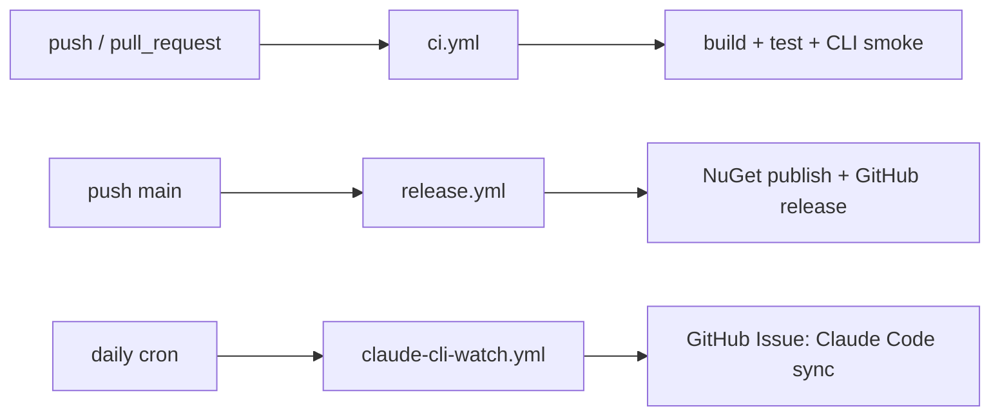

# Feature: Release and Claude Code CLI Sync Automation

Links:
Architecture: [docs/Architecture/Overview.md](../Architecture/Overview.md)
Modules: [.github/workflows](../../.github/workflows)
ADRs: [001-claude-cli-wrapper.md](../ADR/001-claude-cli-wrapper.md)

---

## Purpose

Keep package quality and upstream Claude Code CLI parity automatically verified through GitHub workflows.

---

## Scope

### In scope

- CI workflow (`ci.yml`)
- release workflow (`release.yml`)
- CodeQL workflow (`codeql.yml`)
- upstream watch workflow (`claude-cli-watch.yml`)
- cross-platform Claude Code CLI smoke workflow (`claude-cli-smoke.yml`)

### Out of scope

- external deployment environments
- branch protection settings configured outside repository

---

## Business Rules

- CI must run build and tests on every push/PR.
- CI and Release workflows must install the published Claude Code CLI package `@anthropic-ai/claude-code`.
- CI and Release workflows must verify unauthenticated Claude CLI behavior in an isolated profile before SDK tests run.
- CI and Release workflows must execute full solution tests before smoke subsets, excluding auth-required tests with `-- --treenode-filter "/*/*/*/*[RequiresClaudeAuth!=true]"`.
- Claude Code CLI smoke test workflow steps must run the current `ClaudeCli_Smoke_*` subset via `ClaudeCodeSharpSDK.Tests` project scope to avoid false `zero tests ran` failures in non-smoke test assemblies.
- Release workflow must build/test before pack/publish.
- Release workflow must read package version from `Directory.Build.props`.
- Release workflow must validate semantic version format before packaging.
- Test-only PRs, including PRs that only adjust submodule-backed upstream reference/tests and do not change SDK production code, must not trigger a package version bump; those changes are committed without creating a new release version.
- Release workflow must pack and publish all NuGet packages:
  - `ManagedCode.ClaudeCodeSharpSDK`
  - `ManagedCode.ClaudeCodeSharpSDK.Extensions.AI`
  - `ManagedCode.ClaudeCodeSharpSDK.Extensions.AgentFramework`
- Release workflow must publish `ManagedCode.ClaudeCodeSharpSDK.Extensions.AgentFramework` on the same stable repository version as core and `Extensions.AI`.
- Release workflow must use generated GitHub release notes.
- Release workflow must create/push git tag `v<version>` before publishing GitHub release.
- Claude Code CLI watch runs daily and opens an issue when upstream `anthropics/claude-code` changed since the pinned submodule SHA.
- Sync automation treats `claude -p --output-format json|stream-json` as the runtime source of truth for protocol validation after upstream changes.
- Sync issue body must include detected candidate changes for CLI flags/models/features and an actionable checklist.
- Sync issue must not auto-assign Copilot by default.
- Duplicate sync issue for the same upstream SHA is not allowed.

---

## Diagrams

---

## Verification

### Test commands

- `dotnet build ManagedCode.ClaudeCodeSharpSDK.slnx -c Release -warnaserror`
- `dotnet test --solution ManagedCode.ClaudeCodeSharpSDK.slnx -c Release`

### Workflow mapping

- CI: [ci.yml](../../.github/workflows/ci.yml)
- Release: [release.yml](../../.github/workflows/release.yml)
- CodeQL: [codeql.yml](../../.github/workflows/codeql.yml)
- CLI Watch: [claude-cli-watch.yml](../../.github/workflows/claude-cli-watch.yml)
- Claude Code CLI smoke workflow: [claude-cli-smoke.yml](../../.github/workflows/claude-cli-smoke.yml)

---

## Definition of Done

- Workflows are versioned and valid in repository.
- Local commands match CI commands.
- Daily sync issue automation is configured and documented.
