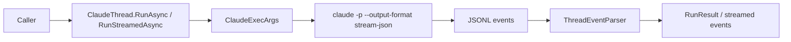

# Feature: ClaudeThread Run Flow

Links:
Architecture: [docs/Architecture/Overview.md](../Architecture/Overview.md)
Modules: [ClaudeThread.cs](../../ClaudeCodeSharpSDK/Client/ClaudeThread.cs), [ClaudeExec.cs](../../ClaudeCodeSharpSDK/Execution/ClaudeExec.cs), [ThreadEventParser.cs](../../ClaudeCodeSharpSDK/Internal/ThreadEventParser.cs)
ADRs: [001-claude-cli-wrapper.md](../ADR/001-claude-cli-wrapper.md), [002-protocol-parsing-and-thread-serialization.md](../ADR/002-protocol-parsing-and-thread-serialization.md)

---

## Purpose

Provide deterministic thread-based execution over Claude Code CLI so C# consumers can run turns, stream events, and resume existing conversations safely.

Runtime source of truth for this feature is the observed non-interactive Claude Code protocol:
- `claude -p --output-format json`
- `claude -p --output-format stream-json --verbose`

The upstream reference repository `anthropics/claude-code` is tracked in this repo as a submodule for change monitoring, but the SDK contract follows actual CLI behavior first.

---

## Scope

### In scope

- Turn execution (`RunAsync`, `RunStreamedAsync`) for plain-text prompts and `IReadOnlyList<UserInput>` requests that currently normalize text-only input.
- Conversion of Claude JSONL stream into typed `ThreadEvent`/`ThreadItem` models.
- ClaudeThread identity tracking across `thread.started` and `resume` flows.
- Failure/cancellation handling and typed structured output.

### Out of scope

- Network transport reimplementation of Claude protocol (SDK uses CLI process).
- Image/file upload transport in print mode.
- Multi-thread merge semantics between separate `ClaudeThread` instances.

---

## Business Rules

- Only one active turn per `ClaudeThread` instance.
- `RunAsync` returns only completed items and latest assistant text as `FinalResponse`.
- `RunAsync<TResponse>` returns `RunResult<TResponse>` with deserialized `TypedResponse`; typed runs require an output schema via either direct `outputSchema` overload parameter or `TurnOptions.OutputSchema`.
- Typed run API supports both concise overloads (`RunAsync<TResponse>(..., outputSchema, ...)`) and full options overloads (`RunAsync<TResponse>(..., turnOptions)`); for AOT-safe typed deserialization pass `JsonTypeInfo<TResponse>`.
- Convenience typed overloads without `JsonTypeInfo<TResponse>` are explicitly marked as AOT-unsafe with `RequiresDynamicCode` and `RequiresUnreferencedCode`.
- `result` events with `is_error: true` must surface as `TurnFailedEvent`, and `RunAsync(...)` must raise `ThreadRunException`.
- For Claude structured output turns, typed JSON may arrive via the `structured_output` field on the final `result` event even when textual `result` is empty; SDK typed runs must deserialize that JSON payload.
- Invalid JSONL event lines must fail fast with parse context.
- Protocol tokens are parsed via constants, not inline literals.
- Optional `ILogger` (`Microsoft.Extensions.Logging`) receives process lifecycle diagnostics (start/success/failure/cancellation).
- Structured output uses typed `StructuredOutputSchema` models (including DTO property selectors) that are serialized inline to `--json-schema`.
- `LocalImageInput` exists in the SDK model layer but is currently rejected in Claude print mode with `NotSupportedException`.
- `TurnOptions.ReplayUserMessages` is currently rejected because the SDK only supports text input, not Claude stream-json input mode.
- Claude executable resolution is deterministic: prefer npm-vendored CLI entry or `node_modules/.bin/claude`, then PATH lookup; on Windows PATH lookup checks `claude.exe`, `claude.cmd`, `claude.bat`, then `claude`.
- Thread options map current Claude Code print-mode flags (`--model`, `--permission-mode`, tool allow/deny lists, system prompts, MCP config, resume/session flags, budget, settings, plugins, betas), plus raw `AdditionalCliArguments` passthrough for future non-transport flags. SDK-managed transport flags are reserved and rejected if passed manually.
- Execution failures are surfaced to the caller with the raw Claude event context preserved in exception chains where available.

---

## User Flows

### Primary flows

1. Start and run turn
- Actor: SDK consumer
- Trigger: `StartThread().RunAsync(...)`
- Steps: build `claude -p` args -> execute Claude Code CLI -> parse stream-json output -> collect result
- Result: `RunResult` with items, usage, final assistant response

2. Start and run typed structured turn
- Actor: SDK consumer
- Trigger: `StartThread().RunAsync<TResponse>(..., outputSchema, ...)` (or `TurnOptions` variant)
- Steps: run regular turn -> deserialize final JSON response to `TResponse` using provided `JsonTypeInfo<TResponse>` when needed
- Result: `RunResult<TResponse>` with typed payload in `TypedResponse`

3. Resume existing thread
- Actor: SDK consumer
- Trigger: `ResumeThread(id).RunAsync(...)`
- Steps: include `--resume <id>` args -> parse events
- Result: turn executes in existing Claude conversation

### Edge cases

- Malformed JSON line -> `InvalidOperationException` with raw line context
- `result` event with `is_error: true` -> `ThreadRunException`
- cancellation token triggered -> execution interrupted and surfaced to caller

---

## Diagrams

---

## Verification

### Test commands

- build: `dotnet build ManagedCode.ClaudeCodeSharpSDK.slnx -c Release -warnaserror`
- test: `dotnet test --solution ManagedCode.ClaudeCodeSharpSDK.slnx -c Release`
- format: `dotnet format ManagedCode.ClaudeCodeSharpSDK.slnx`
- coverage: `dotnet test --solution ManagedCode.ClaudeCodeSharpSDK.slnx -c Release -- --coverage --coverage-output-format cobertura --coverage-output coverage.cobertura.xml`

### Test mapping

- ClaudeThread behavior: [ClaudeThreadTests.cs](../../ClaudeCodeSharpSDK.Tests/Unit/ClaudeThreadTests.cs)
- Protocol parsing: [ThreadEventParserTests.cs](../../ClaudeCodeSharpSDK.Tests/Unit/ThreadEventParserTests.cs)
- CLI argument mapping: [ClaudeExecTests.cs](../../ClaudeCodeSharpSDK.Tests/Unit/ClaudeExecTests.cs)
- Client lifecycle: [ClaudeClientTests.cs](../../ClaudeCodeSharpSDK.Tests/Unit/ClaudeClientTests.cs)

---

## Definition of Done

- Public thread APIs stay aligned with current Claude Code CLI contracts and documented in repository feature/architecture docs.
- All listed tests pass.
- Typed structured output API keeps explicit AOT-safe (`JsonTypeInfo<TResponse>`) and convenience overload contracts documented and covered by tests.
- Docs remain aligned with code and CI workflows.
